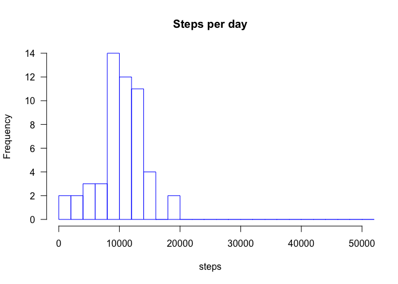
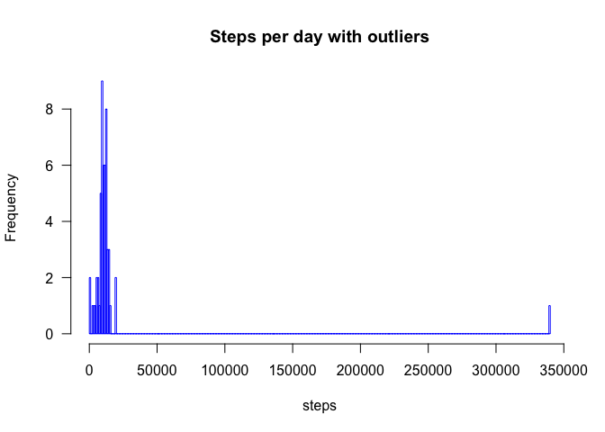
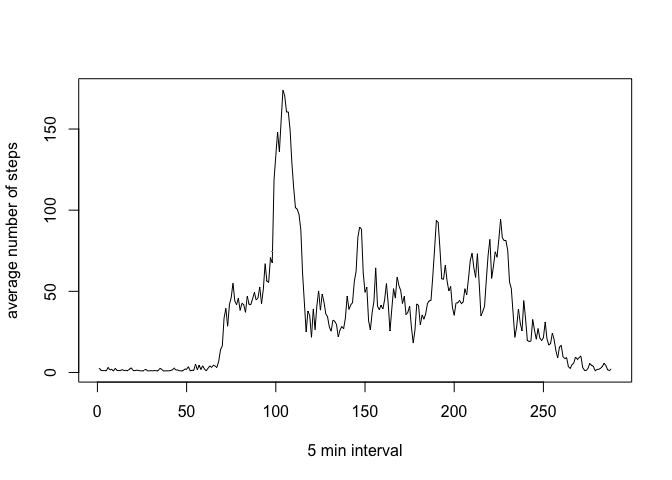
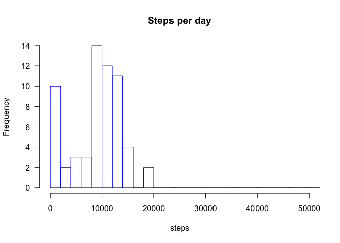

### Code for reading in the dataset and/or processing the data

```r
df <- read.csv(file="activity.csv", header=TRUE, sep=",")
library(tidyr)
df$steps <- factor(df$steps)
df_wide <- spread(df, date, steps)
```

### Calculate statistics

```r
# Calculate the total number of steps taken per day
steps_per_day <- colSums(sapply(df_wide, as.numeric))
steps_per_day
```

```
##   interval 2012-10-01 2012-10-02 2012-10-03 2012-10-04 2012-10-05 
##     339120         NA        414      10925      11776      12743 
## 2012-10-06 2012-10-07 2012-10-08 2012-10-09 2012-10-10 2012-10-11 
##      14867      10867         NA      11816       9877       9316 
## 2012-10-12 2012-10-13 2012-10-14 2012-10-15 2012-10-16 2012-10-17 
##      15769      12019      14404       9355      13848      12414 
## 2012-10-18 2012-10-19 2012-10-20 2012-10-21 2012-10-22 2012-10-23 
##       9309      11592      10048       8735      12428       8887 
## 2012-10-24 2012-10-25 2012-10-26 2012-10-27 2012-10-28 2012-10-29 
##       8304       2707       6894       9934      11340       5138 
## 2012-10-30 2012-10-31 2012-11-01 2012-11-02 2012-11-03 2012-11-04 
##       9594      14207         NA       9762      10360         NA 
## 2012-11-05 2012-11-06 2012-11-07 2012-11-08 2012-11-09 2012-11-10 
##       9676       8291      12054       3453         NA         NA 
## 2012-11-11 2012-11-12 2012-11-13 2012-11-14 2012-11-15 2012-11-16 
##      12146      10314       7466         NA        329       5550 
## 2012-11-17 2012-11-18 2012-11-19 2012-11-20 2012-11-21 2012-11-22 
##      12995      13816       8017       4653      11513      19306 
## 2012-11-23 2012-11-24 2012-11-25 2012-11-26 2012-11-27 2012-11-28 
##      19130      13028      11562      10419      12328       9160 
## 2012-11-29 2012-11-30 
##       6964         NA
```

```r
# Median number of steps taken each day
summary(steps_per_day)[3]
```

```
##  Median 
## 10389.5
```

```r
# Median number of steps taken each day
summary(steps_per_day)[4]
```

```
##     Mean 
## 16313.69
```

### Histogram of the total number of steps taken each day

```r
hist(steps_per_day, 
     main="Steps per day", 
     xlab="steps", 
     border="blue",
     xlim = c(1, 50000),
     las=1, 
     breaks=200)
```

<!-- -->

```r
# and to show outliers:
hist(steps_per_day, 
     main="Steps per day with outliers", 
     xlab="steps", 
     border="blue",
     las=1, 
     breaks=400)
```

<!-- -->

### Time intervals statistics

```r
# Calculate average number of steps per each interval across all days
avg <- rowMeans(sapply(df_wide[2:62], as.numeric), na.rm = TRUE)

# Rename avg vector
names(avg) <- df_wide$interval

# The 5-minute interval that, on average, contains the maximum number of steps
avg[which.max(avg)]
```

```
##      835 
## 174.0755
```

### Time series plot

```r
plot.ts(avg, xlab = "5 min interval", ylab = "average number of steps")
```

<!-- -->

### Imputing missing values

```r
# Calculate and report the total number of missing values in the dataset 
sum(is.na(df$steps))
```

```
## [1] 2304
```

```r
# Replace missing values by Weighted Moving Average (from imputeTS package)
library(imputeTS)
a <- na.ma(as.numeric(df$steps))

# Create new dataset with replaced values
df$steps <- a
df$steps <- factor(df$steps)
df_wide_noNA <- spread(df, date, steps)

# Calculate the total number of steps taken per day -- No NAs
steps_per_day_noNA <- colSums(sapply(df_wide_noNA, as.numeric))
steps_per_day_noNA
```

```
##   interval 2012-10-01 2012-10-02 2012-10-03 2012-10-04 2012-10-05 
##     339120        288        414      10925      11776      12743 
## 2012-10-06 2012-10-07 2012-10-08 2012-10-09 2012-10-10 2012-10-11 
##      14867      10867        288      11816       9877       9316 
## 2012-10-12 2012-10-13 2012-10-14 2012-10-15 2012-10-16 2012-10-17 
##      15769      12019      14404       9355      13848      12414 
## 2012-10-18 2012-10-19 2012-10-20 2012-10-21 2012-10-22 2012-10-23 
##       9309      11592      10048       8735      12428       8887 
## 2012-10-24 2012-10-25 2012-10-26 2012-10-27 2012-10-28 2012-10-29 
##       8304       2707       6894       9934      11340       5138 
## 2012-10-30 2012-10-31 2012-11-01 2012-11-02 2012-11-03 2012-11-04 
##       9594      14207        288       9762      10360        288 
## 2012-11-05 2012-11-06 2012-11-07 2012-11-08 2012-11-09 2012-11-10 
##       9676       8291      12054       3453        288        288 
## 2012-11-11 2012-11-12 2012-11-13 2012-11-14 2012-11-15 2012-11-16 
##      12146      10314       7466        288        329       5550 
## 2012-11-17 2012-11-18 2012-11-19 2012-11-20 2012-11-21 2012-11-22 
##      12995      13816       8017       4653      11513      19306 
## 2012-11-23 2012-11-24 2012-11-25 2012-11-26 2012-11-27 2012-11-28 
##      19130      13028      11562      10419      12328       9160 
## 2012-11-29 2012-11-30 
##       6964        288
```

```r
# Median number of steps taken each day
summary(steps_per_day_noNA)[3]
```

```
## Median 
## 9905.5
```

```r
# Median number of steps taken each day
summary(steps_per_day_noNA)[4]
```

```
##     Mean 
## 14245.85
```

### Repeat the histogram without missing values

```r
hist(steps_per_day_noNA, 
     main="Steps per day", 
     xlab="steps",
     xlim = c(1, 50000),
     border="blue",
     las=1, 
     breaks=200)
```

<!-- -->

#### Do these values differ from the estimates from the first part of the assignment? What is the impact of imputing missing data on the estimates of the total daily number of steps?

We can see that new mean and median have decreased as compared with the first part. Imputing missing data makes the total daily number of steps go down.

### Are there differences in activity patterns between weekdays and weekends?

```r
# Find weekdays vs weekends in dates
library(timeDate)
w <-isWeekday(df$date, wday=1:5)

# Check the number of weekdays (TRUE) and weekends (FALSE) in dataset
table(w)
```

```
## w
## FALSE  TRUE 
##  4608 12960
```

```r
# Make new wide dataframe
df$w <-w
df_wide_w <- spread(df, date, steps)
avg_w <- rowMeans(sapply(df_wide_w[3:63], as.numeric), na.rm = TRUE)
```

### Panel plot comparing the average number of steps taken per 5-minute interval across weekdays and weekends

```r
plot(as.factor(df_wide_w$w), avg_w, xlab = "weekends (FALSE) vs weekdays (TRUE)", ylab = "average number of steps")
```

<!-- -->


